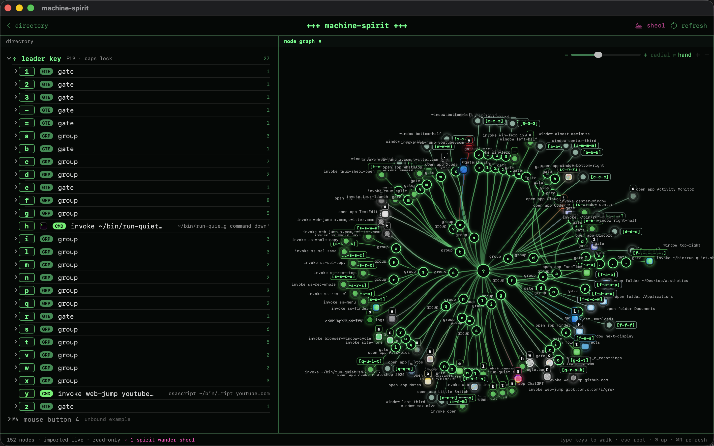

# machine-spirit

A reproducible, keyboard-driven macOS environment as version-controlled code. Clone it onto any Mac, run one script, and get the same launcher, key remaps, terminal, and window behavior back — including a terminal that greets you properly.


The philosophy is simple: the machine's configuration is a **canonical artifact**, not a pile of clicks you'll forget. Every change flows back into the repo, so the current state is always captured, diffable, and redeployable.

> **Where this is going:** [`VISION.md`](VISION.md) is the shareable vision — the thesis, what it does today, and where it's headed (a visual node-graph editor for your whole input layer). Start there for the *why*.

## Philosophy

Most window setups pick a side. Tiling window managers make the keyboard mandatory — every window snaps to a grid, the mouse is treated as failure. Stock macOS makes the mouse mandatory — free-floating windows, drag everything, keyboard shortcuts are an afterthought. Both are dogmatic in opposite directions.

machine-spirit sits in the middle on purpose. It adds a keyboard layer — a leader-key launcher, spatial window commands, an inline-image feed — on top of macOS rather than replacing its model. Nothing here removes the mouse. Windows still float; you still drag when dragging is the better move. But when launching an app, snapping a window to a quadrant, or jumping to a monitor is faster from the keyboard — and it usually is — that path exists and it's fast.

Being anti-mouse is a pose, not a philosophy. The real win isn't picking one input — it's running both at once. Kick off an action with the mouse or trackpad on one screen or pane while your other hand drives a second from the keyboard: start a drag or a selection here, snap and launch and cycle there, no context-switch between them. That's what makes this a *hybrid* tiling window manager — a keyboard-commanded tiling layer over a desktop you can still just reach out and touch, both hands live at the same time.

The name is the thesis: the machine has a spirit you learn to commune with through the keyboard, but it's still a machine you can just reach out and touch. The goal isn't purity. It's a machine that fits the hand — keyboard where keyboard wins, mouse where mouse wins, and the friction of choosing between them designed away.

Everything else in this repo follows from that: additive not replacing, portable by construction, the repo as the canonical artifact, zero secrets, assets pre-rendered so the runtime stays light.

**A running theme: killing window overflow.** macOS lets windows pile up without bound — dozens of overlapping, half-forgotten windows across apps and Spaces, with no first-class notion of "put this away" or "there's too much here." (Arguably a real weakness versus Windows' more disciplined window model; maybe personal, but it bites.) A lot of machine-spirit is quietly aimed at this: the spatial window grid *places* windows instead of letting them scatter, `⇪ i t` pulls all of one app's windows forward at once, the hotkey terminal is a single summonable surface instead of N stray terminals, and **sheol** is the terminal version of the same fight — detached tmux sessions don't rot as invisible clutter, they're gathered into one ledger you actively clear. Reducing window entropy is a design goal, not an afterthought.

## Features

- **Leader-key launcher** (a [Leader Key](https://github.com/mikker/LeaderKey) hard-fork, `forks/LeaderKey`, now the daily driver) — one activation key opens a nested, Vim-style shortcut tree. `⇪ c o` → Codex, `⇪ c l` → Claude, `⇪ i t` → iTerm, `⇪ g p` → ChatGPT app, `⇪ g w` → an existing ChatGPT tab in Safari, and so on. No global-shortcut collisions, no chords to memorize. Full listing in [Keybind reference](#keybind-reference). See [The launcher fork](#the-launcher--machinespirit-leader-key-fork).
- **Silent leader key** ([Karabiner-Elements](https://karabiner-elements.pqrs.org/)) — Caps Lock is remapped to `F19`, a phantom key nothing else uses. It no longer capitalizes, the green LED never lights, and it becomes a clean, dedicated trigger.
- **Smart launch actions** — plain app launches focus-if-running / launch-if-closed automatically; websites get the same treatment from a single parameterized script ([`bin/web-jump.applescript`](bin/web-jump.applescript)): focus the site's tab if open, open it if not, cycle through its tabs on repeat presses. Any site, one config line. Whole *apps* get the same ladder from [`bin/app-jump.applescript`](bin/app-jump.applescript): launch if closed, focus (restoring minimized windows) if backgrounded, cycle windows in order once frontmost — `⇪ s a` for Safari, `⇪ c h r` for Chrome, `⇪ f i` for Finder; any app is one config line (the logic rides macOS's own ⌘\` / ⌘N, so it's app-agnostic).
- **Spatial window grid** ([Rectangle](https://rectangleapp.com/) driven from Leader Key via its URL scheme) — the window keys mirror screen positions: `⇪ q q q` top-left, `⇪ x x x` bottom half, `⇪ b b b` center third, and so on. Grow/shrink is a smooth eased animation from a small AppleScript, not an instant jump. See [Window management](#window-management).
- **iTerm2** — terminal-first workflow, splits, and a custom color scheme. See [`config/iterm2/`](config/iterm2/).
- **Hotkey-window splash** ([`shell/splash/`](shell/splash/)) — every summon of the hotkey terminal boots a randomized, typed-out splash: blackletter banners in five scripts, an ASCII skull or dragon, fastfetch, a quote from a 54-deep rotation, and blinking unicode charms. See [Terminal splash](#terminal-splash) below.
- **One skull menu for three tools** — the fork's menu-bar item is a skull (pupils light up when you summon) whose dropdown folds Leader Key, Rectangle (window actions via its URL scheme), and Karabiner (live status + profile via `karabiner_cli`) into one labeled menu; Rectangle's and Karabiner's own icons are hidden. Ice / Thaw still hides clutter, with [Stats](https://github.com/exelban/stats) for monitoring. See [The launcher fork](#the-launcher--machinespirit-leader-key-fork).
- **Memory-pressure gauge** — a native menu-bar readout of the machine's real memory *pressure* (`100 − kern.memorystatus_level`), not RAM usage: a gauge whose needle and color escalate green → orange → red with the kernel's VM pressure level. It's syscall-cheap (one `sysctl` + one `host_statistics64`, no subprocess) and event-driven off a `DispatchSourceMemoryPressure`, so it flips the instant pressure changes; the dropdown breaks down App / Wired / Compressed / Cached / Free / Swap. Complements Stats' RAM % — pressure is the signal that actually predicts a stall. See [The launcher fork](#the-launcher--machinespirit-leader-key-fork).
- **macOS tweaks** — snappier window resize and animation via reversible `defaults` writes.
- **No dead-end dialogs** — a failed keybind (e.g. resizing an app that refuses it) silently does nothing instead of throwing a focus-stealing macOS alert that blocks the launcher. See [Command reliability](#command-reliability--no-focus-stealing-dialogs).
- **tmux protection + sheol** (experimental) — `⇪ t t` opens a pane running inside tmux (one window, status bar + **TMUX** badge), so its work survives the window closing. `⇪ t m u x` opens **sheol**, a necromancer's ledger of your tmux "spirits" — living (attached) vs wandering the underworld (detached), auto-refreshing — where you **revive** (`r`, reattach in a new window), **commune** (`c`, peek in place), or **banish** (`d·d·d`, destroy forever). See [tmux protection & sheol](#tmux-protection--sheol-experimental).

## Quick start (fresh Mac)

```bash
git clone https://github.com/legions-dialect6s/machine-spirit ~/machine-spirit
cd ~/machine-spirit
./install.sh
```

`install.sh` is idempotent. It installs Homebrew if missing, installs every app from the [`Brewfile`](Brewfile), restores your configs (backing up anything it replaces), and prints the short list of permissions macOS requires you to grant by hand.

## Keeping it in sync

The repo is **capture-based**: your live configs are the source of truth, and `sync.sh` pulls them in.

```bash
# after changing a keybind, remap, or script:
./scripts/sync.sh          # pull live config -> repo
git diff                   # review
git add -A && git commit -m "tweak: ..." && git push
```

Home-directory paths (e.g. inside Leader Key's config) are rewritten to a `__HOME__` placeholder on the way in and expanded back on install — so the repo is portable and never hard-codes a username.

## Keybind reference

**How to run anything:** tap `⇪` (Caps Lock — remapped to F19, so it never capitalizes), then type a sequence. Leader Key pops a panel showing the keys available at each level, so you can explore by just tapping `⇪` and looking. `Esc` backs out. `⇪ l k` opens Leader Key's own settings.

The tree follows four rules, by escalating "weight" of the action:

1. **One tap** — frequent and harmless: `h` hides, `y` cycles YouTube tabs.
2. **Two taps, first-two-letters mnemonic** — apps and tools: `m e` → **Me**ssages, `s p` → **Sp**otify, `d i` → **Di**scord. Read the sequence as the start of the app's name.
3. **Three taps of the same letter** — window placement. The repetition is deliberate friction (a mistyped sequence never yeets a window) and the letters form a spatial grid (see [Window management](#window-management)). The two exceptions are grow/shrink at two taps, because they're pressed repeatedly.
4. **Spelled-out words** — destructive actions: `q u i t` literally types the word to ⌘Q the frontmost app. Quitting should never be one slip away; making you spell it *is* the confirmation dialog.

### Apps

| Keys | Opens | | Keys | Opens |
|---|---|---|---|---|
| `⇪ a c` | Activity Monitor | | `⇪ n o` | Notes |
| `⇪ c l` | Claude | | `⇪ p h` | Photos |
| `⇪ c o` | Codex | | `⇪ p s` | Photoshop |
| `⇪ c h r` | Chrome (jump/cycle) | | `⇪ s a` | Safari (jump/cycle) |
| `⇪ f i` | Finder (jump/cycle) | | | |
| `⇪ d i` | Discord | | `⇪ s e` | System Settings |
| `⇪ f a c` / `⇪ f t` | FaceTime | | `⇪ s p` | Spotify |
| `⇪ f i` | Finder | | `⇪ t e` | TextEdit |
| `⇪ g p` | ChatGPT | | `⇪ t r` | Terminal |
| `⇪ i t` | iTerm | | `⇪ v m w` | VMware Fusion |
| `⇪ m e` | Messages | | `⇪ w h` | WhatsApp |

`⇪ s a` (Safari), `⇪ c h r` (Chrome), and `⇪ f i` (Finder) all run [`bin/app-jump.applescript`](bin/app-jump.applescript) with an app name — the whole-app analogue of `web-jump`, one ladder for every app: **not running → launch; backgrounded → restore its minimized windows and bring it forward (opening a window if none); already frontmost → cycle its windows in order, wrapping**. It rides macOS's native ⌘\` / ⌘N, so it's genuinely app-agnostic rather than scripted per app — any Cocoa app (Preview, Notes, TextEdit…) is one config line. (Its predecessor, [`bin/browser-window-cycle.applescript`](bin/browser-window-cycle.applescript), cycled only the frontmost browser and stranded minimized windows; it stays in `bin/` unused.)

`⇪ v m w` runs [`bin/vmware.applescript`](bin/vmware.applescript) — activate if running, launch if not. (Cycling between individual VM windows isn't cleanly scriptable; use ⌘\` once focused.)

### Web — focus-or-cycle-or-open

Every site key runs the same script, [`bin/web-jump.applescript`](bin/web-jump.applescript): if no tab for the site exists it opens one; if one exists it focuses it; if you're **already on it, pressing again cycles** through all matching tabs across every window. Adding a site is one Leader Key entry — `osascript ~/bin/web-jump.applescript <domains> [fallback-url]` — no new script.

| Keys | Site | Notes |
|---|---|---|
| `⇪ g i t` | GitHub | spells "git" |
| `⇪ g o` | Google | |
| `⇪ g w` | ChatGPT web | matches chatgpt.com + chat.openai.com |
| `⇪ g r o k` | Grok | spells "grok"; matches grok.com + x.com/i/grok |
| `⇪ i g` | Instagram | |
| `⇪ s x` / `⇪ s t` / `⇪ x .` | X / Twitter | matches x.com + twitter.com (three aliases for the same jump) |
| `⇪ y` | YouTube | |
| `⇪ r r` | — | strips the current tab's URL to the site's home page ([`bin/site-home.applescript`](bin/site-home.applescript)) |

### Folders & terminal

| Keys | Action |
|---|---|
| `⇪ f a e` | aesthetics folder (~/Desktop/aesthetics) |
| `⇪ f a p p` | Applications folder |
| `⇪ f d o c` | Documents |
| `⇪ f d o w` | Downloads |
| `⇪ f p` | ~/projects |
| `⇪ f s s` | screenshots folder |
| `⇪ f . . . . .` | open Trash in Finder |
| `⇪ i n` | new iTerm window |

### Screenshots (`⇪ s s …` — screen, then how)

| Keys | Action |
|---|---|
| `⇪ s s s c` / `⇪ s s s s` | **s**election → **c**opy / **s**ave |
| `⇪ s s w c` / `⇪ s s w s` | **w**hole screen → **c**opy / **s**ave |
| `⇪ s s r s` / `⇪ s s r w` | **r**ecord **s**election / **w**hole screen |
| `⇪ s s r x` | stop recording |
| `⇪ s s f` / `⇪ s s m` | reveal in Finder / screenshot menu |

### System

| Keys | Action |
|---|---|
| `⇪ h` | hide frontmost app (⌘H) |
| `⇪ q u i t` | quit frontmost app (⌘Q) — spelled out on purpose |
| `⇪ l l` | focus the address/search bar (sends ⌘L to the frontmost app) |
| `⇪ l k` | Leader Key settings (see limitation below) |

`⇪ l l` sends ⌘L to whatever's frontmost, which focuses the address/search bar in **every browser** — Safari, Chrome, Arc, Brave, Firefox all bind ⌘L natively, so the bind is universal by construction (nothing is browser-hardcoded); in a non-browser app it does nothing (routed through `run-quiet.sh`). *Future:* cycling through multiple in-page search/entry fields is planned via the Accessibility API (real field focus, not a simulated Tab) — which fields should count is an open design question. This v1 just hits the primary address bar via ⌘L.

**`⇪ l k` limitation:** it only surfaces Leader Key's settings if the settings window is *already* open — menu-bar apps don't reliably pop their settings from `open -a`, so from a cold state you still need a manual **⌘,** once Leader Key is focused. To be properly fixed when Leader Key is forked into machine-spirit and we own the settings-open behavior directly.

**Reloading after a config edit:** Leader Key does not reliably hot-reload `config.json` — a changed bind stays stale until the app restarts. Run [`bin/reload-leaderkey.sh`](bin/reload-leaderkey.sh) after any edit (by hand or via `sync.sh`) to make it live.

Window placement and resize live in [Window management](#window-management) below. This listing is maintained by hand — after changing bindings, re-run `./scripts/sync.sh` and update the tables in the same commit.

## Window management

Rectangle does the window math; Leader Key drives it through Rectangle's URL scheme (`open -g "rectangle://execute-action?name=..."`). The bindings form a spatial grid — each key sits on the keyboard where it sends the window on screen:

```
⇪ q q q   top-left        ⇪ w w w   top half        ⇪ e e e   top-right
⇪ a a a   left half                                 ⇪ d d d   right half
⇪ z z z   bottom-left     ⇪ x x x   bottom half     ⇪ c c c   bottom-right
⇪ v v v   left third      ⇪ b b b   center third    ⇪ n n n   right third
⇪ 1 1 1   first third     ⇪ 2 2 2   center third    ⇪ 3 3 3   last third
⇪ c s s   center          ⇪ m m m   maximize        ⇪ f f f   other display
⇪ c e n   center (screen) ⇪ a m m m almost-maximize
⇪ = =     grow            ⇪ - -     shrink          ⇪ q u i t  ⌘Q frontmost app
```

- **Triple letters** for placement so a fat-fingered leader sequence never yeets a window; the two resize keys are **double-taps** because they're pressed repeatedly. (Notes moved to `⇪ n o` when `n` became the right-third group.)
- **Thirds two ways**: the spatial letters `v`/`b`/`n` (left/center/right) and the numeric row `1`/`2`/`3` (first/center/last) both drive Rectangle's thirds — pick whichever your hand reaches for.
- **Two centers**: `⇪ c s s` is Rectangle's own center action; `⇪ c e n` runs [`bin/center-window.applescript`](bin/center-window.applescript), which centers the frontmost window on *whichever display it currently sits on* (multi-monitor aware) without resizing it.
- **`⇪ a m m m`** is Rectangle's almost-maximize (a small inset from full-screen).
- **Grow/shrink bypass Rectangle**: [`bin/win-lerp.applescript`](bin/win-lerp.applescript) animates the frontmost window ±120 px over 22 smoothstep-eased frames — centered as it scales, clamped at screen edges, with a 300×200 floor so shrink-spam can't crush a window. Rectangle's resizes are instant jumps; this one glides.
- **`⇪ f f f`** cycles displays (with two monitors, a toggle); Rectangle centers the window on arrival, so no follow-up action is needed.
- Rectangle's *native* larger/smaller step is bumped to 100 px by [`scripts/macos-defaults.sh`](scripts/macos-defaults.sh) for when it's triggered outside Leader Key.

## The launcher — MachineSpirit Leader Key fork

The launcher is a **hard-fork of [Leader Key](https://github.com/mikker/LeaderKey)** ([`forks/LeaderKey`](forks/LeaderKey), MIT), built from source and run as the daily driver — the same [design goal](HANDOFF-NOTES.md) as owning Rectangle: a small, learnable app we control end-to-end (it fires the board's live pulse, and it's where per-keystroke hooks will land). It reads the **exact same** config as stock (`~/Library/Application Support/Leader Key/config.json`), so every bind is unchanged — it's a drop-in.

What the fork adds over stock:

- **Self-healing daily driver.** A LaunchAgent ([`config/leader-key/com.machinespirit.leader-key.plist`](config/leader-key/com.machinespirit.leader-key.plist)) starts it at login and relaunches it **if it ever crashes** (`KeepAlive` / `SuccessfulExit=false`), while respecting a deliberate Quit. `install.sh` builds the fork from source and installs the agent.
- **One skull menu, three tools.** The menu-bar icon is a skull (idle = hollow stare, summoned = pupils light up) whose dropdown has three labeled sections: **Leader Key** (native), **Rectangle** (window actions via the `rectangle://` scheme), and **Karabiner** (live *● Active* status + current profile via the official `karabiner_cli` — never rebuilt, per design cache #4). Rectangle's and Karabiner's own icons are hidden (`macos-defaults.sh` + `karabiner.json` `global.show_in_menu_bar`), so one skull replaces three icons.
- **Memory-pressure gauge** ([`MemoryPressureStatusItem.swift`](forks/LeaderKey/Leader%20Key/MemoryPressureStatusItem.swift)). A second menu-bar item surfaces the one system stat worth a permanent glance: **memory pressure**, not RAM %. On macOS, RAM "usage" runs high by design (the kernel hoards free pages as file cache), so it's a poor stress signal; pressure — how hard the VM is compressing/swapping/reclaiming — is what actually predicts a stall. The headline number is `100 − kern.memorystatus_level` (the kernel's own available-memory figure, the same one jetsam uses); a gauge needle tracks it and the tint escalates **green → orange → red** off `kern.memorystatus_vm_pressure_level`. Every read is a couple of syscalls (`sysctlbyname` + one `host_statistics64`) — no `/usr/bin` subprocess, no Stats-style polling — and level changes arrive event-driven via a `DispatchSourceMemoryPressure`, so it reacts instantly while the 2 s timer just keeps the % lively. The dropdown breaks memory down App / Wired / Compressed / Cached files / Free / Swap and links to Activity Monitor. It rides the skull's show/hide (same `showMenuBarIcon` toggle) and is deliberately **separate from Stats** — Stats keeps showing RAM %, this owns pressure.
- **Crash fix.** Stock's summon path fell back to a display-less `NSScreen()` when no screen resolved (pointer in a gap between displays, or a display sleep/wake mid-summon) and trapped in AppKit — a real "my hotkeys just died" bug. The fork uses a proper fallback chain and guards the async window-init races.

**Crowded menu bar:** macOS puts a newly-added status item in the hidden overflow first. If the skull isn't visible, ⌘-drag it left of the clock once — macOS remembers the spot.

## Terminal splash


Every summon of the iTerm hotkey window boots a randomized splash, typed to the screen a character at a time (`shell/splash/splash.zsh`):

- **Banner** — "welcome user" pre-rendered in blackletter and engraved typefaces × four languages (English, Finnish, Swedish, Old English), stepped through one per launch, plus Arabic calligraphy and Paleo-Hebrew one-offs. 38 banners in [`shell/splash/banners/`](shell/splash/banners/) — delete all but your favorites to lock in.
- **Caption** — blinking `+++ 𝖂𝖊𝖑𝖈𝖔𝖒𝖊 𝖀𝖘𝖊𝖗 +++` in blackletter unicode, following the banner's language.
- **Logo** — random pick from [`shell/splash/logos/`](shell/splash/logos/) (winged censer skull, dragon). Art too tall for the window automatically drops the banner for that launch. Add your own: any ASCII art as a `.txt` (`$1`/`$2` are fastfetch color placeholders, `$2` blinks; escape literal `$` as `$$`).
- **System info** — fastfetch beside the logo; the separator line is a rhythm of cuneiform `𒐫`, re-randomized every launch.
- **Quote** — one of ~54: Heraclitus and Plotinus in Greek with translation, Quran in Arabic and English, KJV/Geneva apocalyptica, Old Norse Hávamál, Nietzsche in German, Nick Land, Planescape: Torment. One `text|Source` line each in [`shell/splash/quotes.txt`](shell/splash/quotes.txt) — add anything.
- **Charms** — up to three random ornaments (`⛧ ⛥ ⛧`, `𓂀 ☥ 𓂀`, `ᛉ ᛟ ᛉ`, ...) beside short info lines, width-guarded so they never wrap. They type in dim, then flicker in to a static bright once the splash settles.

### Wiring

- Sourced from `shell/aliases.zsh`; fires only when `ITERM_PROFILE` is `Hotkey Window` (or `HOTKEY_PANE=1` for testing). Normal panes stay completely silent.
- Runtime dependencies: zsh, iTerm2, and `fastfetch` (in the Brewfile). All art ships pre-rendered.
- iTerm profile expectations: a hotkey-window profile named **Hotkey Window**, roughly 39 rows × 125 columns, **Blinking text** enabled. `touch ~/.hushlogin` reclaims the "Last login" row; slow the blink with `defaults write com.googlecode.iterm2 timeBetweenBlinks -float 1.2`. iTerm only applies profile Rows/Columns when the hotkey window is recreated.
- The `𒐫` separator and Paleo-Hebrew caption need a font with those glyphs (Noto Sans Cuneiform / Phoenician) — everything else is self-contained.
- Knobs: `HOTKEY_SPLASH_BURST` (typing speed), `HOTKEY_SPLASH_CAPTION`, `HOTKEY_SPLASH_LOGO`, `HOTKEY_SPLASH_ORNAMENTS=0`.
- Regenerating art: [`shell/splash/tools/`](shell/splash/tools/) has the CoreText text→PNG renderers and the density-based ASCII downsampler; banners came from OFL typefaces (Google Fonts) via `chafa --symbols block --stretch -s 114x10`.

## tmux protection & sheol (experimental)

Deliberate terminal protection you opt into at launch, plus a way to recover sessions that outlived their window. (This replaced an earlier "busy-pane shield" experiment — see the design notes for why.)

### `⇪ t t` — launch a protected pane

Opens a **new iTerm window running inside tmux** ([`bin/tmux-launch.sh`](bin/tmux-launch.sh) → [`bin/tmux-session.sh`](bin/tmux-session.sh)), under an auto-generated session name (`ms-HHMMSS`). Because tmux is the parent, the work **survives the window/pane being closed** — reattach it later from sheol. It's **one window** with tmux's **status bar along the bottom** (plus a **TMUX** badge) as the visible "this is protected" proof; control it with tmux's `Ctrl-b` (e.g. `Ctrl-b d` to detach and leave it running).

> We deliberately use plain tmux, **not** control mode (`tmux -CC`): control mode renders tmux windows as separate native iTerm windows and leaves a confusing "gateway" window behind — two windows per launch. Plain tmux is one window, one status bar, no ghost.

> ⚠️ **Hard constraint (by tmux's design, not a bug):** you **cannot** adopt an already-running process into tmux — tmux must be the **parent from launch**. So this only protects panes *started* this way; an existing busy pane can't be retrofitted.

### `⇪ t d` — split into a protected pane

[`bin/tmux-split.sh`](bin/tmux-split.sh) splits the **current** iTerm pane and runs a tmux-protected shell in the new half — a hardened pane right beside where you are. (If you're already inside a tmux session and want a tmux split of *that* session, use tmux's own `Ctrl-b "` / `Ctrl-b %`.)

### `⇪ t m u x` — sheol, the necromancer's ledger

[`bin/tmux-sheol.sh`](bin/tmux-sheol.sh) opens **sheol**, the necromancer's ledger of tmux spirits — and the theme is load-bearing, not decoration. A session with a watcher walks **the land of the living**; a detached one is a **restless spirit wandering the underworld**, its work still alive, awaiting revival or banishment. Two rosters, **auto-refreshed** (~2s poll, so spirits appear and vanish live as you spawn/kill them):

- **☀ THE LIVING** — attached sessions (a client is watching)
- **⌁ SHEOL** — detached/orphaned sessions (no watcher; the work lives on)

Each row: **name · command · born · quiet-for**.

| key | action |
|---|---|
| `↑` / `↓` or `k` / `j` | walk the ledger |
| `r` | **revive** — reattach the spirit in a **new** terminal window (a fresh body in the land of the living); the ledger stays open |
| `c` | **commune** — step *into* the spirit in place to tend it *without* fully reviving it; the session's status bar shows the way back (`Ctrl-b d → back to sheol`), and detaching returns you to the ledger |
| `d` `d` `d` | **banish** — press `d` three times (the `◆` ward decaying). A **living** spirit is **sent to sheol** (detached); a spirit **already in sheol** is **exiled** (killed forever). |

(`⌘W` or `q` closes the ledger window.) *Revive* gives the spirit a new body (new window); *commune* is a temporary séance (detach with `Ctrl-b d` to return here); *banish* is two-tier — banishing the **living** just **detaches** them into sheol (recoverable), while banishing what's **already dead exiles it for good** (killed), which is why the triple-tap ward guards it. There is deliberately **no Enter-to-attach** (an accidental Enter used to dump you straight into a session — gone).

Under the hood, every tmux operation (list/revive/detach/kill) goes through [`bin/sheol-core`](bin/sheol-core) — a policy-free verb layer shared between this TUI and MachineSpirit.app's live sheol node, so both always agree on what the spirits are doing. The two-tier banish decision stays in the callers.

Only ever **one sheol** runs: pressing `⇪ t m u x` again kills any open ledger and opens a fresh one. It renders on the alternate screen with in-place redraw, so the ~2s auto-refresh doesn't flicker the scrollbar or flash the screen, and a brief `+++ S H E O L +++` reveal plays on open.

> **Stuck in an attached session** (e.g. one running a full-screen TUI that eats `Ctrl-b`)? From any *other* window run `tmux detach-client` — it pops every client out; the sessions keep living.

### Honest limits

- ⚠️ **No "detached-at" time.** tmux doesn't record *when* a session detached — there's no such timestamp in its model. **quiet-for** is time since last activity (`#{session_activity}`), the closest proxy.
- ⚠️ **You can't retrofit tmux onto a running process** — necromancy only revives spirits that were tmux-born (`⇪ t t`). No adopt-a-live-process path exists in tmux.
- 🚧 **Non-tmux "fragile" panes aren't listed yet.** A full ledger of *every* terminal and its state (fragile / hardened / living / dead) needs iTerm's API to enumerate panes — a future item that fits the theme well.
- 🚧 **The nag is deferred.** A Dock/menu-bar presence that appears **only while spirits wander**, is hard to ignore, and auto-clears when empty **cannot** be done by a plain terminal script (needs a GUI agent). Deferred to the machine-spirit app, with a first-class GUI ledger tab.
- 🩹 **bash 3.2 gotcha (fixed):** macOS ships bash 3.2, which rejects *fractional* `read -t` timeouts — that silently broke arrow-key nav until caught. sheol uses integer timeouts + `j`/`k`; any future TUI here must stay 3.2-safe.
- **No custom pane button** (gold/Iron-Warriors-yellow) — iTerm's API doesn't expose pane-title buttons; the tmux status bar + badge are the markers. Future item.

### what we're doing here

sheol is the first piece of a terminal necromancer theme for machine-spirit. the idea: your terminals are spirits. living ones have a watcher, detached ones wander the underworld with their work still breathing, and you get to revive them, commune with them, or banish them for good. it started as a way to never lose a long running session again and turned into something with a bit of soul. the real version lives in the machine-spirit app later (a dock nag that only haunts you while spirits wander, a gui ledger, non-tmux fragile terminals listed too). for now it's a terminal tui and it already goes hard. lean into the language everywhere: land of the living, restless spirits, revive, commune, banish. it's a workflow tool that's also a little bit alive.

## MachineSpirit.app — the board (in progress)



The beginning of the [north star](#north-star--machine-spirit-as-its-own-tool-not-yet-built): a native app (`app/` + `kit/`) that imports the live Leader Key config **losslessly** (round-trip proven by a headless test gate) and renders it two ways, side by side — a directory tree and a radial node-graph board. Walk either view with the leader grammar itself (type `s s w s` and travel the tree), drag nodes into your own arrangement (two named layouts, the computed `radial` ⇄ your `hand` — switching never destroys either), and when a bind executes on the keyboard the board answers: the fired route pulses from the center out to the node (a `machinespirit://` ping; the Leader Key fork — now the daily driver — fires it on every executed action). And the pen is wired: the board's **+ / −** buttons add and remove leaf binds by writing the live config itself, always through the armored gate (round-trip precondition → timestamped backup → validate-before-landing → atomic swap) — the fork hot-reloads the change, and the footer reports every write node-by-node with the backup path a hover away.

## Busy-pane shield (opt-in, default off)

An experiment kept as a **toggle**: closing an iTerm pane that's running a live job (`claude`, `node`, a build) escalates Halo-style instead of dying on the first ⌘W — eased damage washes, a shield break, then an ASCII skull death on the fourth hit. It's driven by an iTerm Python-API daemon ([`bin/pane-shield.py`](bin/pane-shield.py)) that ⌘W is bound to.

Honestly, it's more toy than necessity — the *safety* it provides is a built-in iTerm checkbox (Settings → Profiles → Session → "Prompt before closing → if jobs besides the login shell running"); the shield is the *fun* version, and terminals aren't game engines, so its polish is limited. It ships **off by default** and toggles with **no re-wiring**:

- `~/bin/shield-on.sh` — arm it (busy panes now escalate on ⌘W)
- `~/bin/shield-off.sh` — disarm it (⌘W closes normally); this is the default

One-time setup is the ⌘W keybinding (iTerm → Keys → Key Bindings → ⌘W → *Invoke Script Function* → `pane_shield(session_id: id)`) and enabling iTerm's Python API. After that, on/off is just the flag file the daemon checks — instant, no restart. See `HANDOFF-NOTES.md` for the full story and why it's not the default.

## Command reliability — no focus-stealing dialogs

Leader Key surfaces a **modal macOS alert whenever a bound command fails** (a non-zero exit, or an AppleScript error on stderr). That alert often spawns *behind* other windows and **blocks all further Leader Key input until it's dismissed** — e.g. tapping grow/shrink (`⇪ = =` / `⇪ - -`) on an app that refuses to be resized used to freeze the launcher. Every bound command is therefore made failure-proof, by **one consistent rule**:

- **Standalone `bin/*.applescript`** guard themselves at the source: the whole body is wrapped in `try … on error … end try`, so a refused resize / missing window / scripting hiccup does nothing instead of raising. (`win-lerp`, `web-jump`, `center-window`, `site-home`, `vmware`, `terminal-front`.)
- **Inline `osascript` and script commands** in the Leader Key config are routed through [`bin/run-quiet.sh`](bin/run-quiet.sh) — a two-line wrapper that runs the command, discards its output, and **always `exit 0`**. Used for the trash/hide/quit/new-iTerm/screenshot-macro binds and every `⇪ s s …` screenshot script (which would otherwise exit non-zero when you press *Esc* to cancel a capture).
- **Pure `open …` launches** (Rectangle actions, app/folder opens) are left as-is — they can't raise an AppleScript error dialog.

Net effect: no Leader Key command can throw a focus-stealing, input-blocking dialog. A failed command silently does nothing.

## Security

This repo is meant to be **public**, so it is built to never leak secrets:

- A strict [`.gitignore`](.gitignore) blocks `.env`, keys, SSH/AWS/GPG dirs, shell histories, and other secret-bearing files.
- A [`gitleaks`](https://github.com/gitleaks/gitleaks) pre-commit hook scans staged changes and blocks the commit if a secret is detected. Enable it once:
  ```bash
  git config core.hooksPath .githooks
  ```
- Only ever commit **sanitized** copies of any shell config. If a file might hold a token, keep it out.

## Layout

```
machine-spirit/
├── install.sh              # bootstrap a fresh Mac
├── Brewfile                # declarative app list
├── CLAUDE.md               # handoff: teaches agent sessions this repo's rules
├── bin/                    # helpers: web-jump, win-lerp, site-home, center-window, vmware
│   ├── run-quiet.sh        # wrap a command so a failure never dialogs (exit 0)
│   ├── tmux-launch.sh      # t t: launch a tmux-protected pane (one window)
│   ├── tmux-session.sh     # the protected pane's program: TMUX badge + exec tmux
│   ├── tmux-split.sh       # t d: split current iTerm pane into a tmux-protected one
│   ├── tmux-sheol.sh       # the sheol TUI: revive / commune / banish tmux spirits
│   ├── sheol-core          # shared primitive verbs (list/revive/detach/kill) — TUI + app
│   ├── tmux-sheol-open.sh  # t m u x: open the ONE sheol (kills any old one first)
│   ├── iterm-new-window.sh # shared: open a new iTerm window running a command
│   ├── reload-leaderkey.sh # restart Leader Key so a config edit goes live
│   └── screenshots/        # screencapture wrappers behind the ⇪ s s tree
├── config/
│   ├── leader-key/         # captured Leader Key config (templated)
│   ├── karabiner/          # captured Karabiner config
│   └── iterm2/             # color scheme + notes
├── shell/
│   ├── aliases.zsh         # sourced from ~/.zshrc; gates the splash
│   ├── cc-image-watch.sh   # live inline-image feed for Claude Code panes
│   └── splash/             # hotkey-window boot splash
│       ├── splash.zsh      # engine: typewriter, rotation, charms
│       ├── banners/        # pre-rendered "welcome user" wordmarks
│       ├── logos/          # ASCII art pool (skull, dragon, yours)
│       ├── quotes.txt      # one text|Source per line
│       └── tools/          # art pipeline: text->PNG, ASCII downsampler
├── scripts/
│   ├── sync.sh             # live config -> repo
│   └── macos-defaults.sh   # reversible macOS tweaks
└── .githooks/pre-commit    # gitleaks secret scan
```

## Roadmap

Honest maybes, not promises — roughly near-term first, north star last.

### Near-term

- **One-line installer** — a `curl | bash` bootstrap wrapping the existing [`install.sh`](install.sh), so onboarding is a single paste.
- **User-initiated updater** — an `update.sh` (git pull → replay `install.sh` → reload configs), maybe with a login-time check that notifies when the repo is ahead. No background auto-apply: config that rewrites itself without asking violates *the machine fits the hand*. Notify, and let you pull.
- **Send window to a specific monitor** — target a named or numbered display, not just "next display" — a precise version of Rectangle's cycle, and a first step toward driving window actions ourselves.

### Visual customization layer — a clean jailbreak for the macOS look

A curated, safe, **reversible** set of appearance tweaks that push macOS's visual customization further than the stock Settings pane allows — packaged the way the rest of this repo is: documented, toggleable, and captured as code. This is the "jailbreak-of-sorts customization" instinct made concrete, and it's squarely on-theme — additive, reversible, the give-in-the-system rather than a fight against it.

Scope (all opt-in, all undoable):

- **Fonts** — system/UI and monospace font replacement, documented so it survives a clean install.
- **UI density & appearance** — spacing, accent and highlight colors, dark/light and contrast hacks via `defaults write`.
- **Menu bar & Dock** — layout, autohide timing, spacing, and clutter control (building on the existing Ice/Thaw setup).
- **Vetted third-party theming tools** — a short, security-reviewed list, each with a one-line "what it does / how to undo it" note, mirroring the Brewfile discipline.

Everything lands as reversible `defaults` writes (extending [`scripts/macos-defaults.sh`](scripts/macos-defaults.sh)) plus a documented toggle, so "here's how to push macOS's look further, cleanly" stays true to the *additive, reversible, repo-as-canonical-artifact* ethos. No irreversible system-file patching; if a tweak can't be cleanly backed out, it doesn't ship.

### North star — machine-spirit as its own tool (not yet built)

Today this repo is a config layer over Leader Key + Rectangle. The destination is a purpose-built app that replaces both — not a nicer menu, but a **visual node-graph editor for the whole input layer**. You'd wire keybinds on a canvas: a shortcut-key node → group and/or action nodes → command nodes (built-in window and launch actions exposed with parameters, animation options, inline script bodies, or links to external scripts). The nested tree Leader Key shows today is just one rendering of that graph. machine-spirit's current binds ship as the default graph, and every Rectangle window action and Leader Key launch behavior is a freely rewireable node.

It's feasible because the hard parts are already open source — Leader Key (leader / tree / summon) and Rectangle (window actions) are permissively licensed — so this is a node-editor UI plus glue over existing engines, not a window manager built from scratch. It also gets its own summon indicator in place of Leader Key's plain dot (say, an animated green ASCII skull fading in and out), which likely means forking Leader Key's overlay — one more reason the endgame is an owned tool rather than a pile of config.

**Positioning — a competitor that stays open to integration.** machine-spirit is constitutionally an *alternative* to AeroSpace / Rectangle / Leader Key, not a wrapper around them. The graph is the engine; those tools become importable templates rather than locked-in dependencies — an exact AeroSpace clone that imports an existing AeroSpace config for in-place migration, a Rectangle preset, a blank canvas, community templates. AeroSpace integration stays possible (opt-in), but the aim is to make it unnecessary by shipping a node-programmable equivalent that's at least as good — including send-to-specific-monitor and full tiling, both expressed as node graphs.

**"Leader keys," plural.** Keep the term as homage to Leader Key, but drop the singular: support multiple simultaneous leaders (a different leader per graph or context) and treat alternative input devices as first-class trigger sources — foot switches, macro pads, MIDI/HID controllers — bindable alongside the keyboard.

### Foundational design notes (flagged now, to decide before building)

- **Serialization format is the first real decision** — human-readable, diffable, version-controllable, and importable from competitors' configs (AeroSpace, Rectangle). Templates, sharing, and "the repo is the canonical artifact" all rest on it.
- **License check, first.** Before building on or redistributing anything derived from Leader Key or Rectangle, confirm their terms permit derivative works and redistribution. Both appear MIT-family / permissive; verify before shipping.
- **macOS-first, on purpose.** Cross-platform is out of scope for now, but the engine should avoid gratuitous macOS lock-in where avoiding it is cheap.
- **Honest scope.** A cross-tool, node-based, multi-input window-and-launcher manager with a visual editor and a migration ecosystem is a substantial project (multi-week-plus, plausibly open-source-with-contributors), not a weekend. A working prototype is close; the polished editor and template ecosystem are the long tail. Ship a prototype (v0.1) first and iterate the editor and templates after — building it early also surfaces engine-integration conflicts before any UI is stacked on top.
- **Fork strategy — hard-fork Leader Key + Rectangle only** (decided; see `HANDOFF-NOTES.md` #8). Both are MIT and small, and owning them is a learning goal — they live in-tree under [`forks/`](forks/) with upstream SHA and license recorded in [`forks/FORK-NOTES.md`](forks/FORK-NOTES.md). Everything else stays external and *managed*, never forked: Karabiner (root daemons + code-signing = keyboard-brick risk) and iTerm2 (huge, GPL) are integrated via config, APIs, and hooks only. The tmux protection + sheol tooling is a live instance of the managed style: it drives iTerm purely through AppleScript + the tmux CLI, adds only things iTerm can cleanly forget, and touches no iTerm internals.
- **Dependency-update safety.** Before allowing an update to a *hooked* dependency, run smoke tests against the specific functionality machine-spirit relies on. Gate or pin updates that would break a hook, and **surface the conflict to the user** rather than silently breaking or silently blocking. This is integration testing against our dependencies — the price of the patch-overlay strategy above.
- **Coordinator, not parent.** When the app exists, it *coordinates* the other tools via their APIs, hooks, and login-item registration — it does **not** become their parent process or own their lifecycles. Leader Key, Rectangle, and iTerm keep running independently; machine-spirit layers behavior on top. This keeps the system antifragile (any component can crash, update, or be removed without taking the others down) and is the architectural form of *additive, not replacing*. The shield's CGEventTap-free design is a concrete down-payment on this.

### Other maybes

- Optional **AeroSpace integration** for users who want its exact behavior (opt-in, additive).
- **Colorimeter-based display-matching** profile.
- **Per-project Leader Key layers** — one keystroke spins up a project's whole window / app / server context.

## License

MIT — see [LICENSE](LICENSE).


