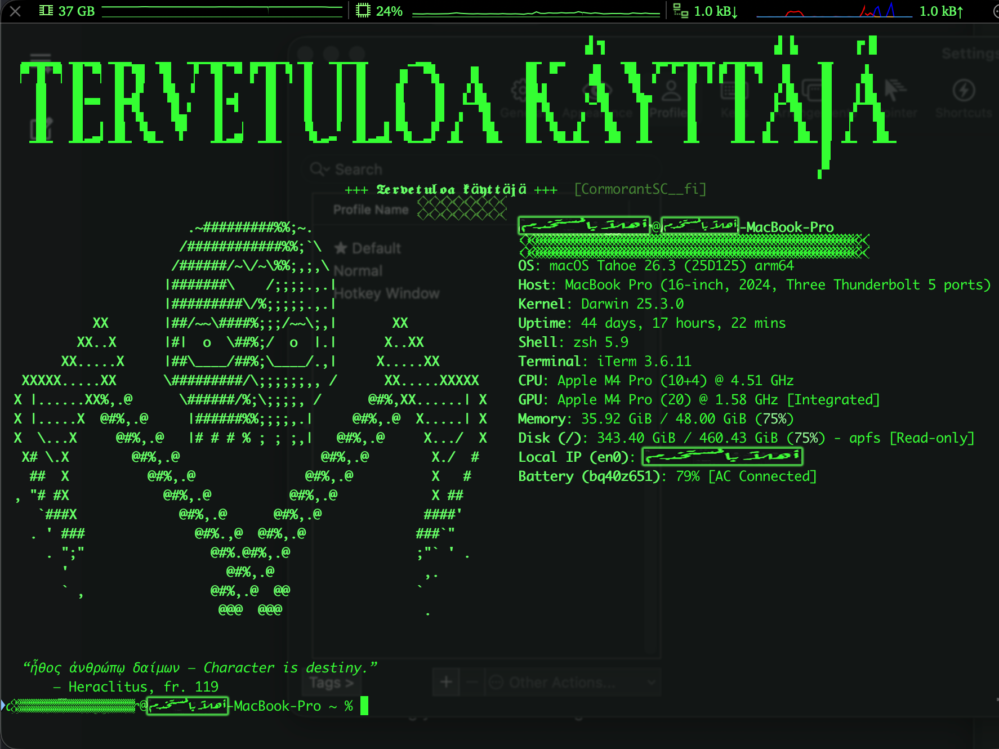
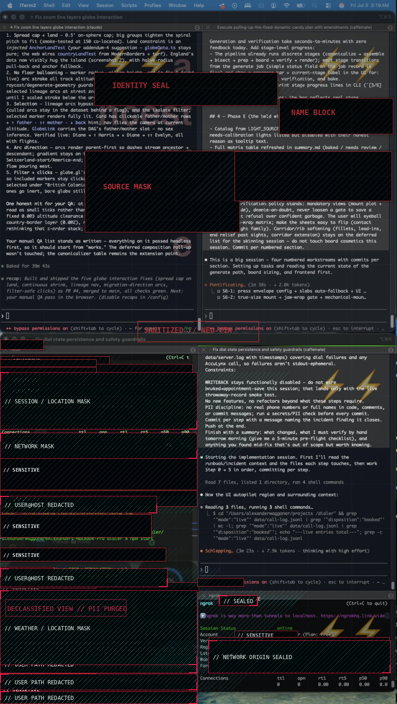

# machine-spirit

A reproducible, keyboard-driven macOS environment as version-controlled code. Clone it onto any Mac, run one script, and get the same launcher, key remaps, terminal, and window behavior back — including a terminal that greets you properly.




The philosophy is simple: the machine's configuration is a **canonical artifact**, not a pile of clicks you'll forget. Every change flows back into the repo, so the current state is always captured, diffable, and redeployable.

## Philosophy

Most window setups pick a side. Tiling window managers make the keyboard mandatory — every window snaps to a grid, the mouse is treated as failure. Stock macOS makes the mouse mandatory — free-floating windows, drag everything, keyboard shortcuts are an afterthought. Both are dogmatic in opposite directions.

machine-spirit sits in the middle on purpose. It adds a keyboard layer — a leader-key launcher, spatial window commands, an inline-image feed — on top of macOS rather than replacing its model. Nothing here removes the mouse. Windows still float; you still drag when dragging is the better move. But when launching an app, snapping a window to a quadrant, or jumping to a monitor is faster from the keyboard — and it usually is — that path exists and it's fast.

Being anti-mouse is a pose, not a philosophy. The real win isn't picking one input — it's running both at once. Kick off an action with the mouse or trackpad on one screen or pane while your other hand drives a second from the keyboard: start a drag or a selection here, snap and launch and cycle there, no context-switch between them. That's what makes this a *hybrid* tiling window manager — a keyboard-commanded tiling layer over a desktop you can still just reach out and touch, both hands live at the same time.

The name is the thesis: the machine has a spirit you learn to commune with through the keyboard, but it's still a machine you can just reach out and touch. The goal isn't purity. It's a machine that fits the hand — keyboard where keyboard wins, mouse where mouse wins, and the friction of choosing between them designed away.

Everything else in this repo follows from that: additive not replacing, portable by construction, the repo as the canonical artifact, zero secrets, assets pre-rendered so the runtime stays light.

## Features

- **Leader-key launcher** ([Leader Key](https://github.com/mikker/LeaderKey)) — one activation key opens a nested, Vim-style shortcut tree. `⇪ c o` → Codex, `⇪ c l` → Claude, `⇪ i t` → iTerm, `⇪ g p` → ChatGPT app, `⇪ g w` → an existing ChatGPT tab in Safari, and so on. No global-shortcut collisions, no chords to memorize. Full listing in [Keybind reference](#keybind-reference).
- **Silent leader key** ([Karabiner-Elements](https://karabiner-elements.pqrs.org/)) — Caps Lock is remapped to `F19`, a phantom key nothing else uses. It no longer capitalizes, the green LED never lights, and it becomes a clean, dedicated trigger.
- **Smart launch actions** — plain app launches focus-if-running / launch-if-closed automatically; websites get the same treatment from a single parameterized script ([`bin/web-jump.applescript`](bin/web-jump.applescript)): focus the site's tab if open, open it if not, cycle through its tabs on repeat presses. Any site, one config line.
- **Spatial window grid** ([Rectangle](https://rectangleapp.com/) driven from Leader Key via its URL scheme) — the window keys mirror screen positions: `⇪ q q q` top-left, `⇪ x x x` bottom half, `⇪ b b b` center third, and so on. Grow/shrink is a smooth eased animation from a small AppleScript, not an instant jump. See [Window management](#window-management).
- **iTerm2** — terminal-first workflow, splits, and a custom color scheme. See [`config/iterm2/`](config/iterm2/).
- **Hotkey-window splash** ([`shell/splash/`](shell/splash/)) — every summon of the hotkey terminal boots a randomized, typed-out splash: blackletter banners in five scripts, an ASCII skull or dragon, fastfetch, a quote from a 54-deep rotation, and blinking unicode charms. See [Terminal splash](#terminal-splash) below.
- **Menu bar management** — Ice / Thaw to hide clutter behind a single toggle, with [Stats](https://github.com/exelban/stats) for system monitoring.
- **macOS tweaks** — snappier window resize and animation via reversible `defaults` writes.
- **No dead-end dialogs** — a failed keybind (e.g. resizing an app that refuses it) silently does nothing instead of throwing a focus-stealing macOS alert that blocks the launcher. See [Command reliability](#command-reliability--no-focus-stealing-dialogs).
- **Busy-pane shield** (experimental, v0.1) — closing an iTerm pane that's running a live command (`claude`, `node`, a build…) doesn't die on the first ⌘W. It escalates Halo-style: a shield flare + rising SFX on hits 1–2, then a **shield-break shatter** on hit 3 that finally closes it. Idle panes still close instantly. One-flag kill switch. See [Busy-pane shield](#busy-pane-shield-experimental).

## Quick start (fresh Mac)

```bash
git clone https://github.com/legions-dialect6s/machine-spirit ~/machine-spirit
cd ~/machine-spirit
./install.sh
```

`install.sh` is idempotent. It installs Homebrew if missing, installs every app from the [`Brewfile`](Brewfile), restores your configs (backing up anything it replaces), and prints the short list of permissions macOS requires you to grant by hand.

## Keeping it in sync

The repo is **capture-based**: your live configs are the source of truth, and `sync.sh` pulls them in.

```bash
# after changing a keybind, remap, or script:
./scripts/sync.sh          # pull live config -> repo
git diff                   # review
git add -A && git commit -m "tweak: ..." && git push
```

Home-directory paths (e.g. inside Leader Key's config) are rewritten to a `__HOME__` placeholder on the way in and expanded back on install — so the repo is portable and never hard-codes a username.

## Keybind reference

**How to run anything:** tap `⇪` (Caps Lock — remapped to F19, so it never capitalizes), then type a sequence. Leader Key pops a panel showing the keys available at each level, so you can explore by just tapping `⇪` and looking. `Esc` backs out. `⇪ l k` opens Leader Key's own settings.

The tree follows four rules, by escalating "weight" of the action:

1. **One tap** — frequent and harmless: `h` hides, `y` cycles YouTube tabs.
2. **Two taps, first-two-letters mnemonic** — apps and tools: `m e` → **Me**ssages, `s p` → **Sp**otify, `d i` → **Di**scord. Read the sequence as the start of the app's name.
3. **Three taps of the same letter** — window placement. The repetition is deliberate friction (a mistyped sequence never yeets a window) and the letters form a spatial grid (see [Window management](#window-management)). The two exceptions are grow/shrink at two taps, because they're pressed repeatedly.
4. **Spelled-out words** — destructive actions: `q u i t` literally types the word to ⌘Q the frontmost app. Quitting should never be one slip away; making you spell it *is* the confirmation dialog.

### Apps

| Keys | Opens | | Keys | Opens |
|---|---|---|---|---|
| `⇪ a c` | Activity Monitor | | `⇪ n o` | Notes |
| `⇪ c l` | Claude | | `⇪ p h` | Photos |
| `⇪ c o` | Codex | | `⇪ p s` | Photoshop |
| `⇪ c h r` | Chrome | | `⇪ s a` | cycle frontmost browser's windows |
| `⇪ d i` | Discord | | `⇪ s e` | System Settings |
| `⇪ f a c` / `⇪ f t` | FaceTime | | `⇪ s p` | Spotify |
| `⇪ f i` | Finder | | `⇪ t e` | TextEdit |
| `⇪ g p` | ChatGPT | | `⇪ t r` | Terminal |
| `⇪ i t` | iTerm | | `⇪ v m w` | VMware Fusion |
| `⇪ m e` | Messages | | `⇪ w h` | WhatsApp |

`⇪ s a` runs [`bin/browser-window-cycle.applescript`](bin/browser-window-cycle.applescript) — cycles the windows of **whatever browser is currently frontmost** (Safari, Chrome, Arc, Brave, Firefox): no windows → opens one, one window → leaves it, multiple → **cycles to the next, wrapping around** — the window-level analogue of what `web-jump` does for tabs. If the frontmost app isn't a known browser it does nothing. It rides on macOS's native "move focus to next window" (⌘\`), so it's genuinely browser-agnostic rather than scripted per app (the per-browser AppleScript reorder only actually works in Safari).

`⇪ v m w` runs [`bin/vmware.applescript`](bin/vmware.applescript) — activate if running, launch if not. (Cycling between individual VM windows isn't cleanly scriptable; use ⌘\` once focused.)

### Web — focus-or-cycle-or-open

Every site key runs the same script, [`bin/web-jump.applescript`](bin/web-jump.applescript): if no tab for the site exists it opens one; if one exists it focuses it; if you're **already on it, pressing again cycles** through all matching tabs across every window. Adding a site is one Leader Key entry — `osascript ~/bin/web-jump.applescript <domains> [fallback-url]` — no new script.

| Keys | Site | Notes |
|---|---|---|
| `⇪ g i t` | GitHub | spells "git" |
| `⇪ g o` | Google | |
| `⇪ g w` | ChatGPT web | matches chatgpt.com + chat.openai.com |
| `⇪ g r o k` | Grok | spells "grok"; matches grok.com + x.com/i/grok |
| `⇪ i g` | Instagram | |
| `⇪ s x` / `⇪ s t` / `⇪ x .` | X / Twitter | matches x.com + twitter.com (three aliases for the same jump) |
| `⇪ y` | YouTube | |
| `⇪ r r` | — | strips the current tab's URL to the site's home page ([`bin/site-home.applescript`](bin/site-home.applescript)) |

### Folders & terminal

| Keys | Action |
|---|---|
| `⇪ f a e` | aesthetics folder (~/Desktop/aesthetics) |
| `⇪ f a p p` | Applications folder |
| `⇪ f d o c` | Documents |
| `⇪ f d o w` | Downloads |
| `⇪ f p` | ~/projects |
| `⇪ f s s` | screenshots folder |
| `⇪ f . . . . .` | open Trash in Finder |
| `⇪ i n` | new iTerm window |

### Screenshots (`⇪ s s …` — screen, then how)

| Keys | Action |
|---|---|
| `⇪ s s s c` / `⇪ s s s s` | **s**election → **c**opy / **s**ave |
| `⇪ s s w c` / `⇪ s s w s` | **w**hole screen → **c**opy / **s**ave |
| `⇪ s s r s` / `⇪ s s r w` | **r**ecord **s**election / **w**hole screen |
| `⇪ s s r x` | stop recording |
| `⇪ s s f` / `⇪ s s m` | reveal in Finder / screenshot menu |

### System

| Keys | Action |
|---|---|
| `⇪ h` | hide frontmost app (⌘H) |
| `⇪ q u i t` | quit frontmost app (⌘Q) — spelled out on purpose |
| `⇪ l l` | focus the address/search bar (sends ⌘L to the frontmost app) |
| `⇪ l k` | Leader Key settings (see limitation below) |

`⇪ l l` sends ⌘L to whatever's frontmost, which focuses the address/search bar in **every browser** — Safari, Chrome, Arc, Brave, Firefox all bind ⌘L natively, so the bind is universal by construction (nothing is browser-hardcoded); in a non-browser app it does nothing (routed through `run-quiet.sh`). *Future:* cycling through multiple in-page search/entry fields is planned via the Accessibility API (real field focus, not a simulated Tab) — which fields should count is an open design question. This v1 just hits the primary address bar via ⌘L.

**`⇪ l k` limitation:** it only surfaces Leader Key's settings if the settings window is *already* open — menu-bar apps don't reliably pop their settings from `open -a`, so from a cold state you still need a manual **⌘,** once Leader Key is focused. To be properly fixed when Leader Key is forked into machine-spirit and we own the settings-open behavior directly.

**Reloading after a config edit:** Leader Key does not reliably hot-reload `config.json` — a changed bind stays stale until the app restarts. Run [`bin/reload-leaderkey.sh`](bin/reload-leaderkey.sh) after any edit (by hand or via `sync.sh`) to make it live.

Window placement and resize live in [Window management](#window-management) below. This listing is maintained by hand — after changing bindings, re-run `./scripts/sync.sh` and update the tables in the same commit.

## Window management

Rectangle does the window math; Leader Key drives it through Rectangle's URL scheme (`open -g "rectangle://execute-action?name=..."`). The bindings form a spatial grid — each key sits on the keyboard where it sends the window on screen:

```
⇪ q q q   top-left        ⇪ w w w   top half        ⇪ e e e   top-right
⇪ a a a   left half                                 ⇪ d d d   right half
⇪ z z z   bottom-left     ⇪ x x x   bottom half     ⇪ c c c   bottom-right
⇪ v v v   left third      ⇪ b b b   center third    ⇪ n n n   right third
⇪ 1 1 1   first third     ⇪ 2 2 2   center third    ⇪ 3 3 3   last third
⇪ c s s   center          ⇪ m m m   maximize        ⇪ f f f   other display
⇪ c e n   center (screen) ⇪ a m m m almost-maximize
⇪ = =     grow            ⇪ - -     shrink          ⇪ q u i t  ⌘Q frontmost app
```

- **Triple letters** for placement so a fat-fingered leader sequence never yeets a window; the two resize keys are **double-taps** because they're pressed repeatedly. (Notes moved to `⇪ n o` when `n` became the right-third group.)
- **Thirds two ways**: the spatial letters `v`/`b`/`n` (left/center/right) and the numeric row `1`/`2`/`3` (first/center/last) both drive Rectangle's thirds — pick whichever your hand reaches for.
- **Two centers**: `⇪ c s s` is Rectangle's own center action; `⇪ c e n` runs [`bin/center-window.applescript`](bin/center-window.applescript), which centers the frontmost window on *whichever display it currently sits on* (multi-monitor aware) without resizing it.
- **`⇪ a m m m`** is Rectangle's almost-maximize (a small inset from full-screen).
- **Grow/shrink bypass Rectangle**: [`bin/win-lerp.applescript`](bin/win-lerp.applescript) animates the frontmost window ±120 px over 22 smoothstep-eased frames — centered as it scales, clamped at screen edges, with a 300×200 floor so shrink-spam can't crush a window. Rectangle's resizes are instant jumps; this one glides.
- **`⇪ f f f`** cycles displays (with two monitors, a toggle); Rectangle centers the window on arrival, so no follow-up action is needed.
- Rectangle's *native* larger/smaller step is bumped to 100 px by [`scripts/macos-defaults.sh`](scripts/macos-defaults.sh) for when it's triggered outside Leader Key.

## Terminal splash


Every summon of the iTerm hotkey window boots a randomized splash, typed to the screen a character at a time (`shell/splash/splash.zsh`):

- **Banner** — "welcome user" pre-rendered in blackletter and engraved typefaces × four languages (English, Finnish, Swedish, Old English), stepped through one per launch, plus Arabic calligraphy and Paleo-Hebrew one-offs. 38 banners in [`shell/splash/banners/`](shell/splash/banners/) — delete all but your favorites to lock in.
- **Caption** — blinking `+++ 𝖂𝖊𝖑𝖈𝖔𝖒𝖊 𝖀𝖘𝖊𝖗 +++` in blackletter unicode, following the banner's language.
- **Logo** — random pick from [`shell/splash/logos/`](shell/splash/logos/) (winged censer skull, dragon). Art too tall for the window automatically drops the banner for that launch. Add your own: any ASCII art as a `.txt` (`$1`/`$2` are fastfetch color placeholders, `$2` blinks; escape literal `$` as `$$`).
- **System info** — fastfetch beside the logo; the separator line is a rhythm of cuneiform `𒐫`, re-randomized every launch.
- **Quote** — one of ~54: Heraclitus and Plotinus in Greek with translation, Quran in Arabic and English, KJV/Geneva apocalyptica, Old Norse Hávamál, Nietzsche in German, Nick Land, Planescape: Torment. One `text|Source` line each in [`shell/splash/quotes.txt`](shell/splash/quotes.txt) — add anything.
- **Charms** — up to three random ornaments (`⛧ ⛥ ⛧`, `𓂀 ☥ 𓂀`, `ᛉ ᛟ ᛉ`, ...) beside short info lines, width-guarded so they never wrap. They type in dim, then flicker in to a static bright once the splash settles.

### Wiring

- Sourced from `shell/aliases.zsh`; fires only when `ITERM_PROFILE` is `Hotkey Window` (or `HOTKEY_PANE=1` for testing). Normal panes stay completely silent.
- Runtime dependencies: zsh, iTerm2, and `fastfetch` (in the Brewfile). All art ships pre-rendered.
- iTerm profile expectations: a hotkey-window profile named **Hotkey Window**, roughly 39 rows × 125 columns, **Blinking text** enabled. `touch ~/.hushlogin` reclaims the "Last login" row; slow the blink with `defaults write com.googlecode.iterm2 timeBetweenBlinks -float 1.2`. iTerm only applies profile Rows/Columns when the hotkey window is recreated.
- The `𒐫` separator and Paleo-Hebrew caption need a font with those glyphs (Noto Sans Cuneiform / Phoenician) — everything else is self-contained.
- Knobs: `HOTKEY_SPLASH_BURST` (typing speed), `HOTKEY_SPLASH_CAPTION`, `HOTKEY_SPLASH_LOGO`, `HOTKEY_SPLASH_ORNAMENTS=0`.
- Regenerating art: [`shell/splash/tools/`](shell/splash/tools/) has the CoreText text→PNG renderers and the density-based ASCII downsampler; banners came from OFL typefaces (Google Fonts) via `chafa --symbols block --stretch -s 114x10`.

## Busy-pane shield (experimental)

> **v0.1 / feasibility prototype.** Real and working, but a probe as much as a feature — read the honest limits at the bottom.

Closing an iTerm2 pane that's *busy* (running a real foreground process — `claude`, `node`, `python`, `caffeinate`, `ngrok`, …) shouldn't instantly kill it on a fat-fingered ⌘W. An idle shell pane closes instantly as always; a busy one raises a shield you have to overload:

| ⌘W on a busy pane | What happens |
|---|---|
| **Hit 1** | `shield-hit` SFX + a cyan **shield flare** (expanding hex energy ring) + a dim-red per-pane flash + badge `◆ SHIELD 1/3 ◆`. Pane stays. |
| **Hit 2** | louder hit + a brighter **amber "overload"** flare + a stronger flash + `◆ SHIELD 2/3 ◆`. Pane stays. |
| **Hit 3** | `shield-break` SFX + a full-screen **shatter** (white flash → radial cracks → glass shards bursting outward with gravity), **then the pane closes** and the counter resets. |
| stop for ~6s | the shield disarms on its own (badge clears). |

### The look

Two visual layers: a **per-pane** background flash + iTerm badge (accurate to the exact pane), and a **full-screen overlay** ([`assets/tools/shield-fx.swift`](assets/tools/shield-fx.swift), compiled to `~/bin/shield-fx`) for the dramatic flare/shatter. The overlay is a transparent, **click-through, non-activating**, top-level window that plays a short Core Animation effect and force-quits itself — it can't steal focus, block input, or linger. The SFX ([`assets/shield-hit.wav`](assets/shield-hit.wav) / [`assets/shield-break.wav`](assets/shield-break.wav)) are **original, synthesized offline** by [`assets/tools/gen-sfx.py`](assets/tools/gen-sfx.py) — zero third-party or game audio.

### Kill switch — and why it's safe by design

The shield **never installs a system-wide `CGEventTap`** — that's the thing that can eat keystrokes globally if its process hangs. Instead, *all* interception is a single iTerm key binding routed to the daemon's RPC ([`bin/pane-shield.py`](bin/pane-shield.py)). So the blast radius is exactly one shortcut in one app.

- **Instant off (no restart):** `~/bin/shield-off.sh` drops a flag file and ⌘W is stock behavior again immediately (busy or not, it just closes). `~/bin/shield-on.sh` re-arms. The daemon keeps running either way.
- **Full teardown:** delete the AutoLaunch symlink and remove the ⌘W key binding in iTerm → ⌘W is 100% native, nothing left behind.
- **Crash safety:** if the daemon dies, the *worst case* is ⌘W does nothing **inside iTerm only** until you restart it or remove the binding. It can **never** capture keystrokes system-wide, because there is no global tap. This trade — losing seamless fallback to guarantee no global keystroke capture — is deliberate.

### Setup (three manual steps)

1. **Enable the iTerm Python API:** iTerm → Settings → **General → Magic → “Enable Python API”** (accept the one-time consent prompt; iTerm downloads its managed runtime + `iterm2` module).
2. **Install:** `install.sh` drops `pane-shield.py` into `~/bin`, symlinks it into iTerm's AutoLaunch dir, and compiles `shield-fx`. Restart iTerm so the daemon loads.
3. **Rebind ⌘W:** iTerm → Settings → **Keys → Key Bindings → `+`** → shortcut ⌘W → Action *Invoke Script Function* → `pane_shield(session_id: \(id))`. Put it under app-level Key Bindings so it covers every pane; delete it to fully disable.

### Honest limits

- ⚠️ **The full-screen overlay is not pane-precise.** The flare/shatter covers the whole display, not a glow ring hugging the pane. The per-pane flash + badge *are* pane-accurate; the cinematic part is screen-wide. A pane-tracked glow (and a shatter of the pane's *real pixels*, which needs Screen Recording permission) is a future item.
- ⚠️ **Requires the iTerm Python API enabled** (one-time manual consent) and works **only in iTerm**, not Terminal.app.
- ⚠️ **Not yet driven end-to-end from CI.** The Python compiles, every iTerm2 API call is validated against the real `iterm2` package, the SFX play, and `shield-fx` runs + self-terminates cleanly — but the physical ⌘W → RPC round-trip needs a live iTerm to confirm. The likeliest spot to need a tweak is the key-binding **Function call** syntax.
- **Busy detection is coarse** — a `jobName` allow-list of shells; anything else counts as busy.

## Command reliability — no focus-stealing dialogs

Leader Key surfaces a **modal macOS alert whenever a bound command fails** (a non-zero exit, or an AppleScript error on stderr). That alert often spawns *behind* other windows and **blocks all further Leader Key input until it's dismissed** — e.g. tapping grow/shrink (`⇪ = =` / `⇪ - -`) on an app that refuses to be resized used to freeze the launcher. Every bound command is therefore made failure-proof, by **one consistent rule**:

- **Standalone `bin/*.applescript`** guard themselves at the source: the whole body is wrapped in `try … on error … end try`, so a refused resize / missing window / scripting hiccup does nothing instead of raising. (`win-lerp`, `web-jump`, `center-window`, `site-home`, `vmware`, `terminal-front`.)
- **Inline `osascript` and script commands** in the Leader Key config are routed through [`bin/run-quiet.sh`](bin/run-quiet.sh) — a two-line wrapper that runs the command, discards its output, and **always `exit 0`**. Used for the trash/hide/quit/new-iTerm/screenshot-macro binds and every `⇪ s s …` screenshot script (which would otherwise exit non-zero when you press *Esc* to cancel a capture).
- **Pure `open …` launches** (Rectangle actions, app/folder opens) are left as-is — they can't raise an AppleScript error dialog.

Net effect: no Leader Key command can throw a focus-stealing, input-blocking dialog. A failed command silently does nothing.

## Security

This repo is meant to be **public**, so it is built to never leak secrets:

- A strict [`.gitignore`](.gitignore) blocks `.env`, keys, SSH/AWS/GPG dirs, shell histories, and other secret-bearing files.
- A [`gitleaks`](https://github.com/gitleaks/gitleaks) pre-commit hook scans staged changes and blocks the commit if a secret is detected. Enable it once:
  ```bash
  git config core.hooksPath .githooks
  ```
- Only ever commit **sanitized** copies of any shell config. If a file might hold a token, keep it out.

## Layout

```
machine-spirit/
├── install.sh              # bootstrap a fresh Mac
├── Brewfile                # declarative app list
├── CLAUDE.md               # handoff: teaches agent sessions this repo's rules
├── bin/                    # helpers: web-jump, win-lerp, site-home, center-window, vmware
│   ├── run-quiet.sh        # wrap a command so a failure never dialogs (exit 0)
│   ├── pane-shield.py      # experimental iTerm2 API daemon: busy-pane close guard
│   ├── shield-off.sh       # kill switch: disable the shield instantly
│   └── shield-on.sh        # re-arm the shield
├── assets/                 # bundled media (committed, not synced)
│   ├── shield-hit.wav      # synthesized SFX (shield absorb)
│   ├── shield-break.wav    # synthesized SFX (overload shatter)
│   └── tools/              # gen-sfx.py (SFX renderer) + shield-fx.swift (overlay)
│   └── screenshots/        # screencapture wrappers behind the ⇪ s s tree
├── config/
│   ├── leader-key/         # captured Leader Key config (templated)
│   ├── karabiner/          # captured Karabiner config
│   └── iterm2/             # color scheme + notes
├── shell/
│   ├── aliases.zsh         # sourced from ~/.zshrc; gates the splash
│   ├── cc-image-watch.sh   # live inline-image feed for Claude Code panes
│   └── splash/             # hotkey-window boot splash
│       ├── splash.zsh      # engine: typewriter, rotation, charms
│       ├── banners/        # pre-rendered "welcome user" wordmarks
│       ├── logos/          # ASCII art pool (skull, dragon, yours)
│       ├── quotes.txt      # one text|Source per line
│       └── tools/          # art pipeline: text->PNG, ASCII downsampler
├── scripts/
│   ├── sync.sh             # live config -> repo
│   └── macos-defaults.sh   # reversible macOS tweaks
└── .githooks/pre-commit    # gitleaks secret scan
```

## Roadmap

Honest maybes, not promises — roughly near-term first, north star last.

### Near-term

- **One-line installer** — a `curl | bash` bootstrap wrapping the existing [`install.sh`](install.sh), so onboarding is a single paste.
- **User-initiated updater** — an `update.sh` (git pull → replay `install.sh` → reload configs), maybe with a login-time check that notifies when the repo is ahead. No background auto-apply: config that rewrites itself without asking violates *the machine fits the hand*. Notify, and let you pull.
- **Send window to a specific monitor** — target a named or numbered display, not just "next display" — a precise version of Rectangle's cycle, and a first step toward driving window actions ourselves.

### Visual customization layer — a clean jailbreak for the macOS look

A curated, safe, **reversible** set of appearance tweaks that push macOS's visual customization further than the stock Settings pane allows — packaged the way the rest of this repo is: documented, toggleable, and captured as code. This is the "jailbreak-of-sorts customization" instinct made concrete, and it's squarely on-theme — additive, reversible, the give-in-the-system rather than a fight against it.

Scope (all opt-in, all undoable):

- **Fonts** — system/UI and monospace font replacement, documented so it survives a clean install.
- **UI density & appearance** — spacing, accent and highlight colors, dark/light and contrast hacks via `defaults write`.
- **Menu bar & Dock** — layout, autohide timing, spacing, and clutter control (building on the existing Ice/Thaw setup).
- **Vetted third-party theming tools** — a short, security-reviewed list, each with a one-line "what it does / how to undo it" note, mirroring the Brewfile discipline.

Everything lands as reversible `defaults` writes (extending [`scripts/macos-defaults.sh`](scripts/macos-defaults.sh)) plus a documented toggle, so "here's how to push macOS's look further, cleanly" stays true to the *additive, reversible, repo-as-canonical-artifact* ethos. No irreversible system-file patching; if a tweak can't be cleanly backed out, it doesn't ship.

### North star — machine-spirit as its own tool (not yet built)

Today this repo is a config layer over Leader Key + Rectangle. The destination is a purpose-built app that replaces both — not a nicer menu, but a **visual node-graph editor for the whole input layer**. You'd wire keybinds on a canvas: a shortcut-key node → group and/or action nodes → command nodes (built-in window and launch actions exposed with parameters, animation options, inline script bodies, or links to external scripts). The nested tree Leader Key shows today is just one rendering of that graph. machine-spirit's current binds ship as the default graph, and every Rectangle window action and Leader Key launch behavior is a freely rewireable node.

It's feasible because the hard parts are already open source — Leader Key (leader / tree / summon) and Rectangle (window actions) are permissively licensed — so this is a node-editor UI plus glue over existing engines, not a window manager built from scratch. It also gets its own summon indicator in place of Leader Key's plain dot (say, an animated green ASCII skull fading in and out), which likely means forking Leader Key's overlay — one more reason the endgame is an owned tool rather than a pile of config.

**Positioning — a competitor that stays open to integration.** machine-spirit is constitutionally an *alternative* to AeroSpace / Rectangle / Leader Key, not a wrapper around them. The graph is the engine; those tools become importable templates rather than locked-in dependencies — an exact AeroSpace clone that imports an existing AeroSpace config for in-place migration, a Rectangle preset, a blank canvas, community templates. AeroSpace integration stays possible (opt-in), but the aim is to make it unnecessary by shipping a node-programmable equivalent that's at least as good — including send-to-specific-monitor and full tiling, both expressed as node graphs.

**"Leader keys," plural.** Keep the term as homage to Leader Key, but drop the singular: support multiple simultaneous leaders (a different leader per graph or context) and treat alternative input devices as first-class trigger sources — foot switches, macro pads, MIDI/HID controllers — bindable alongside the keyboard.

### Foundational design notes (flagged now, to decide before building)

- **Serialization format is the first real decision** — human-readable, diffable, version-controllable, and importable from competitors' configs (AeroSpace, Rectangle). Templates, sharing, and "the repo is the canonical artifact" all rest on it.
- **License check, first.** Before building on or redistributing anything derived from Leader Key or Rectangle, confirm their terms permit derivative works and redistribution. Both appear MIT-family / permissive; verify before shipping.
- **macOS-first, on purpose.** Cross-platform is out of scope for now, but the engine should avoid gratuitous macOS lock-in where avoiding it is cheap.
- **Honest scope.** A cross-tool, node-based, multi-input window-and-launcher manager with a visual editor and a migration ecosystem is a substantial project (multi-week-plus, plausibly open-source-with-contributors), not a weekend. A working prototype is close; the polished editor and template ecosystem are the long tail. Ship a prototype (v0.1) first and iterate the editor and templates after — building it early also surfaces engine-integration conflicts before any UI is stacked on top.
- **Harness-fork / patch-overlay strategy.** Modify open-source dependencies (Leader Key, Rectangle, iTerm) via *layered, interceptable exceptions* — API hooks, key-binding routes, config injection, login-item registration — rather than hard forks. Upstream security and feature updates keep flowing, and any modification can be reverted to the tool's stable behavior. Avoid maintaining full forks except where genuinely unavoidable (e.g. a custom summon-overlay that requires forking Leader Key's overlay). The busy-pane shield is the first live instance: it hooks iTerm purely through its public Python API and unbinds in one click, with iTerm itself untouched.
- **Dependency-update safety.** Before allowing an update to a *hooked* dependency, run smoke tests against the specific functionality machine-spirit relies on. Gate or pin updates that would break a hook, and **surface the conflict to the user** rather than silently breaking or silently blocking. This is integration testing against our dependencies — the price of the patch-overlay strategy above.
- **Coordinator, not parent.** When the app exists, it *coordinates* the other tools via their APIs, hooks, and login-item registration — it does **not** become their parent process or own their lifecycles. Leader Key, Rectangle, and iTerm keep running independently; machine-spirit layers behavior on top. This keeps the system antifragile (any component can crash, update, or be removed without taking the others down) and is the architectural form of *additive, not replacing*. The shield's CGEventTap-free design is a concrete down-payment on this.

### Other maybes

- Optional **AeroSpace integration** for users who want its exact behavior (opt-in, additive).
- **Colorimeter-based display-matching** profile.
- **Per-project Leader Key layers** — one keystroke spins up a project's whole window / app / server context.

## License

MIT — see [LICENSE](LICENSE).



